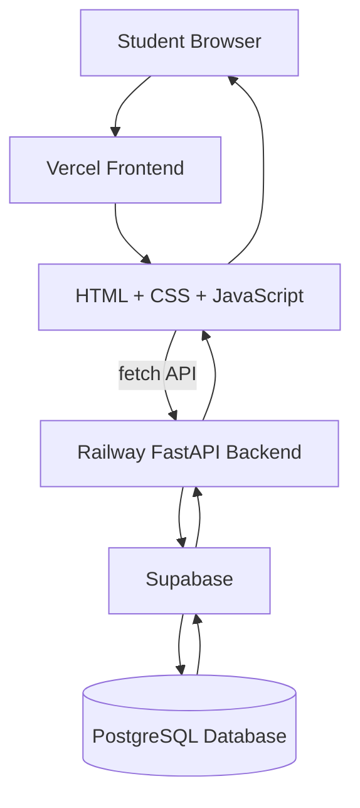
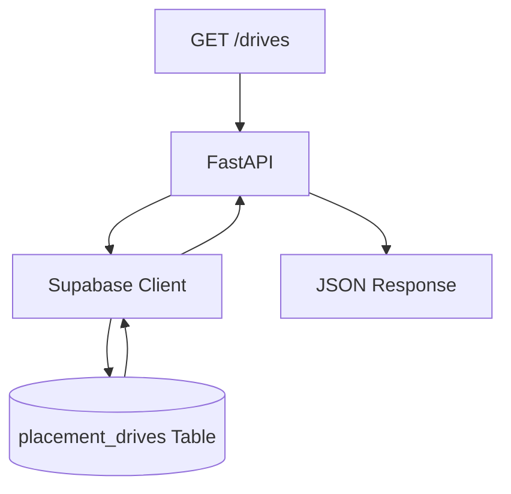
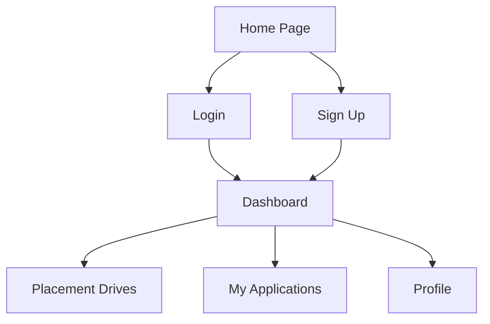
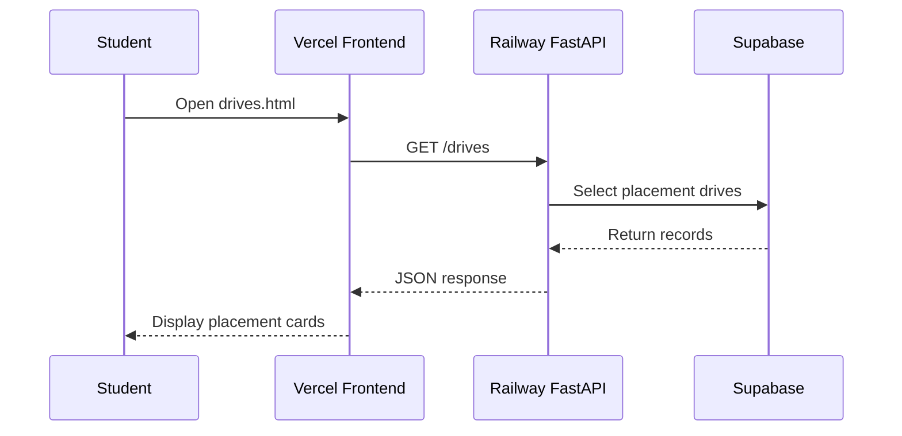
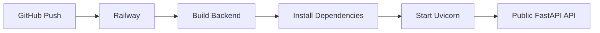
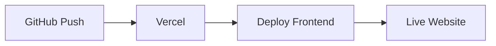
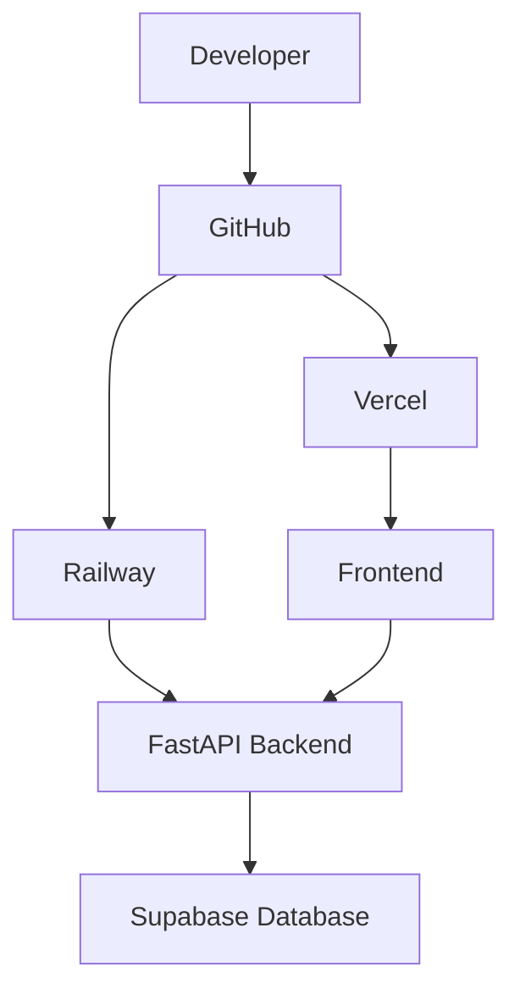
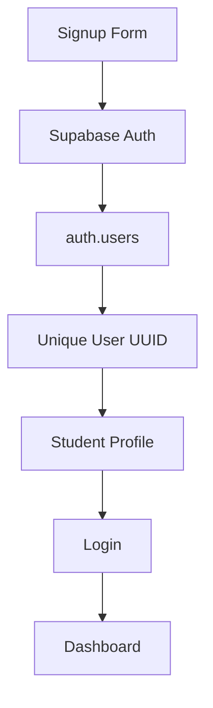
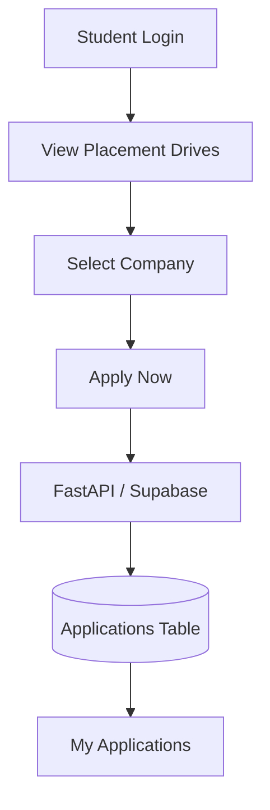
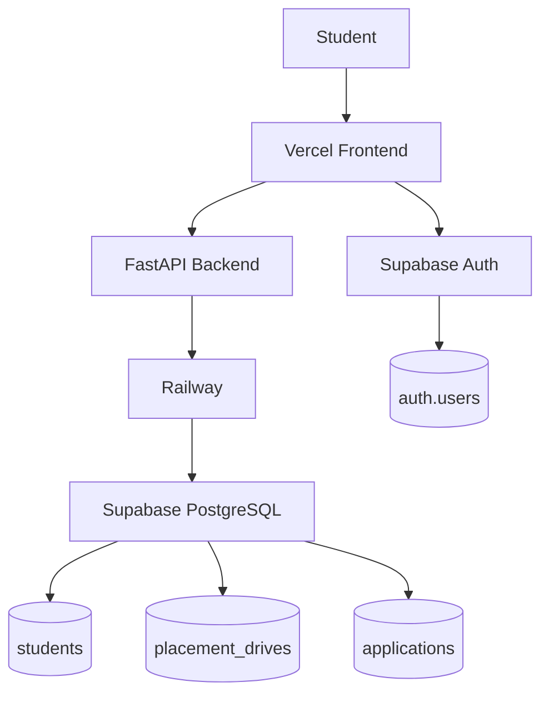

# 🎓 College Placement Drive Portal

A full-stack **College Placement Drive Portal** built for students to explore placement opportunities through a responsive frontend connected with a **FastAPI backend**, **Supabase database**, **Railway deployment**, and **Vercel hosting**.

<p align="center">
  <a href="https://clg-placment-drive-pn48i233s-lokeshkale1803-8471s-projects.vercel.app/">
    <strong>🌐 Live Frontend — Vercel</strong>
  </a>
  &nbsp;&nbsp;•&nbsp;&nbsp;
  <a href="https://clgplacmentdrive-production.up.railway.app/docs">
    <strong>⚡ Live Backend API — Swagger</strong>
  </a>
</p>

---

## 🚀 Live Project Links

| Service | Link |
|---|---|
| 🌐 Frontend | [Open Vercel Website](https://clg-placment-drive-pn48i233s-lokeshkale1803-8471s-projects.vercel.app/) |
| ⚡ Backend API | [Open Railway Swagger Docs](https://clgplacmentdrive-production.up.railway.app/docs) |
| 📡 Placement Drives API | [GET /drives](https://clgplacmentdrive-production.up.railway.app/drives) |
| 💻 GitHub Repository | [lokeshkale1803/CLG_Placment_drive](https://github.com/lokeshkale1803/CLG_Placment_drive) |

---

# 📌 Project Overview

The **College Placement Drive Portal** is designed to provide students with a centralized platform for viewing placement drives.

The project includes:

- Student-facing frontend
- FastAPI backend
- Supabase PostgreSQL database
- Railway backend deployment
- Vercel frontend deployment
- GitHub version control

The project is currently being extended with:

- Student signup
- Student login
- Supabase Authentication
- Student profile
- Placement applications
- Application status tracking

---

# 🏗️ Current Architecture



---

# 🧰 Technology Stack

| Layer | Technology |
|---|---|
| Frontend | HTML, CSS, JavaScript |
| Backend | Python, FastAPI |
| API Server | Uvicorn |
| Database | Supabase PostgreSQL |
| Database Client | Supabase Python Client |
| Environment Variables | python-dotenv |
| Backend Hosting | Railway |
| Frontend Hosting | Vercel |
| Version Control | Git + GitHub |

---

# 📂 Project Structure

```text
CLG_Placment_drive/
│
├── Backend/
│   ├── main.py
│   ├── database.py
│   ├── requirements.txt
│   └── .env
│
├── Frontend/
│   ├── index.html
│   ├── login.html
│   ├── signup.html
│   ├── dashboard.html
│   ├── drives.html
│   ├── applications.html
│   ├── profile.html
│   │
│   ├── css/
│   │   ├── style.css
│   │   ├── auth.css
│   │   └── dashboard.css
│   │
│   ├── js/
│   │   ├── config.js
│   │   ├── auth.js
│   │   ├── home.js
│   │   ├── dashboard.js
│   │   ├── drives.js
│   │   ├── applications.js
│   │   └── profile.js
│   │
│   └── assets/
│
├── documentation.md
├── README.md
└── .gitignore
```

> `.env` is used locally and should never be committed to GitHub.

---

# ⚙️ Backend Development

The backend is built using **FastAPI**.

## Install FastAPI

```bash
python -m pip install fastapi uvicorn
```

Verify installation:

```bash
python -m pip show fastapi
```

Run the backend:

```bash
python -m uvicorn main:app --reload --port 8001
```

Local backend:

```text
http://127.0.0.1:8001
```

Swagger UI:

```text
http://127.0.0.1:8001/docs
```

---

# 🔌 API Endpoints

The backend contains REST API endpoints for placement drives.

| Method | Endpoint | Purpose |
|---|---|---|
| GET | `/` | Check backend status |
| GET | `/drives` | Get all placement drives |
| GET | `/drives/{drive_id}` | Get one placement drive |
| POST | `/drives` | Add a placement drive |
| PUT | `/drives/{drive_id}` | Update a placement drive |
| DELETE | `/drives/{drive_id}` | Delete a placement drive |

Example:

```text
GET /drives
```

---

# 🗄️ Supabase Database

Supabase is used as the PostgreSQL database.

## `placement_drives` Table

| Column | Type | Description |
|---|---|---|
| `id` | int8 | Primary Key, Identity |
| `company_name` | text | Company name |
| `job_role` | text | Offered role |
| `package` | float8 | Package in LPA |
| `location` | text | Job location |
| `minimum_cgpa` | float8 | Minimum CGPA |
| `drive_date` | date | Placement drive date |
| `created_at` | timestamptz | Creation timestamp |

---

# 🔗 Supabase Connection

Supabase is connected using:

```text
Backend/database.py
```

```python
from supabase import create_client
from dotenv import load_dotenv
import os

load_dotenv()

SUPABASE_URL = os.getenv("SUPABASE_URL")
SUPABASE_KEY = os.getenv("SUPABASE_KEY")

supabase = create_client(
    SUPABASE_URL,
    SUPABASE_KEY
)
```

The `.env` file contains:

```env
SUPABASE_URL=your_supabase_url
SUPABASE_KEY=your_supabase_key
```

---

# 📡 Database Fetch Flow



---

# 🌐 Frontend Development

The frontend is built using:

- HTML
- CSS
- JavaScript

Main pages:

| Page | Purpose |
|---|---|
| `index.html` | Home Page |
| `login.html` | Student Login |
| `signup.html` | Student Signup |
| `dashboard.html` | Student Dashboard |
| `drives.html` | Placement Drives |
| `applications.html` | Applications |
| `profile.html` | Student Profile |

---

# 🔄 Frontend Flow



---

# 🔗 Frontend and Backend Connection

The deployed frontend communicates with the Railway backend using JavaScript `fetch()`.

File:

```text
Frontend/js/config.js
```

```javascript
const API_BASE_URL =
    "https://clgplacmentdrive-production.up.railway.app";
```

Example:

```javascript
const response = await fetch(
    `${API_BASE_URL}/drives`
);

const data = await response.json();
```

---

# 📊 Placement Drive Fetch Flow



---

# 🧾 Placement Drive Data

Sample placement drives currently stored in the database include:

```text
TCS
Infosys
Accenture
Capgemini
Cognizant
Wipro
Tech Mahindra
Persistent Systems
LTIMindtree
Deloitte
```

The sample data is used for development and testing purposes.

---

# 🔐 CORS Configuration

Because the frontend and backend are hosted on different domains, CORS is enabled in FastAPI.

```python
from fastapi.middleware.cors import CORSMiddleware

app.add_middleware(
    CORSMiddleware,
    allow_origins=["*"],
    allow_credentials=False,
    allow_methods=["*"],
    allow_headers=["*"],
)
```

Current architecture:

```text
Vercel
   ↓
Railway
   ↓
Supabase
```

---

# 🚂 Railway Backend Deployment

The FastAPI backend is hosted on Railway.

## Railway Root Directory

```text
Backend
```

## Build Command

```bash
pip install fastapi uvicorn supabase python-dotenv
```

## Start Command

```bash
uvicorn main:app --host 0.0.0.0 --port $PORT
```

## Environment Variables

```text
SUPABASE_URL
SUPABASE_KEY
```

These credentials are stored securely inside Railway.

---

# 🚂 Railway Deployment Flow



Backend Swagger:

```text
https://clgplacmentdrive-production.up.railway.app/docs
```

---

# ▲ Vercel Frontend Deployment

The frontend is deployed on Vercel.

Vercel settings:

```text
Framework Preset: Other
Root Directory: Frontend
```

Live frontend:

```text
https://clg-placment-drive-pn48i233s-lokeshkale1803-8471s-projects.vercel.app/
```

---

# ▲ Vercel Deployment Flow



---

# 🔄 Complete Deployment Flow



---

# ✅ Current Features

- Responsive frontend
- Placement Drive page
- FastAPI backend
- REST APIs
- Swagger documentation
- Supabase PostgreSQL database
- Placement drive database integration
- JavaScript API fetching
- Dynamic placement drive cards
- Railway backend hosting
- Vercel frontend hosting
- GitHub version control
- CORS configuration

---

# 🚧 Features In Progress

The following features are currently planned or under development:

- Real student signup
- Real student login
- Supabase Authentication
- Student-specific profile
- Student application submission
- My Applications page
- Application status tracking
- Admin functionality
- Role-based access control

---

# 🔐 Planned Authentication Flow



The password will be handled securely by **Supabase Auth**.

Passwords will not be manually stored inside the student profile table.

---

# 👤 Planned Student Table

The student profile table is planned to contain:

| Column | Purpose |
|---|---|
| `id` | Supabase Auth UUID |
| `full_name` | Student Name |
| `email` | Student Email |
| `phone` | Phone Number |
| `branch` | Branch |
| `cgpa` | Student CGPA |
| `graduation_year` | Passing Year |
| `backlogs` | Backlog Count |
| `skills` | Student Skills |
| `resume_url` | Resume Link |
| `created_at` | Created Time |

---

# 📝 Planned Application Flow



---

# 📋 Planned Applications Table

| Column | Purpose |
|---|---|
| `id` | Application ID |
| `student_id` | Student User ID |
| `drive_id` | Placement Drive ID |
| `status` | Application Status |
| `applied_at` | Application Date |

Possible statuses:

```text
Applied
Shortlisted
Selected
Rejected
```

---

# 🔮 Final Planned Architecture



---

# 🔒 Security Notes

- `.env` should never be uploaded to GitHub.
- Supabase secret keys should only remain on the backend.
- Service role keys must never be exposed in frontend JavaScript.
- Supabase Row Level Security should be configured for tables accessed by frontend users.
- Production CORS can later be restricted to the official Vercel domain.

---

# 🧪 Local Development

## Backend

```bash
cd Backend
python -m uvicorn main:app --reload --port 8001
```

Swagger:

```text
http://127.0.0.1:8001/docs
```

## Frontend

```bash
cd Frontend
python -m http.server 5500
```

Frontend:

```text
http://localhost:5500
```

---

# 📚 Detailed Documentation

For the complete step-by-step development process, see:

```text
documentation.md
```

---

# 👨‍💻 Author

**Lokesh Kale**

GitHub:

[https://github.com/lokeshkale1803](https://github.com/lokeshkale1803)

---

# 🎯 Project Status

```text
Frontend            ✅
FastAPI Backend      ✅
Supabase Database    ✅
Railway Deployment   ✅
Vercel Deployment    ✅
Placement Fetching   ✅
Supabase Auth        🚧
Applications         🚧
Admin Panel          🚧
```

---

<p align="center">
  <strong>🎓 College Placement Drive Portal</strong>
  <br>
  FastAPI • Supabase • Railway • Vercel
</p>
